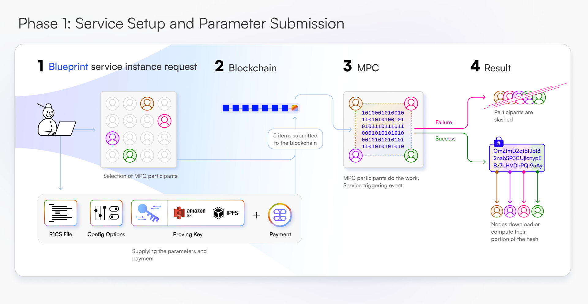

# Actively Validated Services on Tangle Network

Tangle Network provides developers with a suite of Actively Validated Services (AVS) to power privacy-enhancing applications, cross-chain applications, and other complex cryptographically secure decentralized applications. By leveraging restaking, Tangle Network enables staked validators to provide these AVS instances to paying developers over a decentralized network.

Through these services, Tangle Network aims to achieve the following for developers:

1. Reduced friction in deploying advanced decentralized applications with complex cryptographic or cryptoeconomic security requirements.
2. Expanded frontier of possible application spaces through cross-chain interoperability and privacy-preserving tools.
3. Simplified APIs for interacting with AVS instances and integrating them into applications.
4. Outsourced computation and processing, eliminating operational burdens for developers.

## Service Categories

### Privacy Use Cases

#### Multi-Party Computation (MPC)

Signatures are pervasive in the design of blockchain bridges, oracles, and custody solutions. Tangle Network offers signature schemes as a service using threshold cryptography, enabling developers to build private and non-private cross-chain applications.

Tangle currently supports several Threshold signature schemes:

- DfnsCGGMP21Secp256k1
- DfnsCGGMP21Secp256r1
- DfnsCGGMP21Stark
- SilentShardDKLS23Secp256k1
- ZcashFrostP256
- ZcashFrostP384
- ZcashFrostSecp256k1
- ZcashFrostEd25519
- ZcashFrostEd448
- ZcashFrostRistretto255
- GennaroDKGBls381

Use cases for MPC services include bridges, oracles, interoperable shielded pools, and social and identity bridges.

Github: https://github.com/webb-tools/gadget

### Proof Generation Use Cases

#### zkSNARKs as a Service (zkSaaS)

Proof generation is critical for maintaining privacy and implementation of complex cryptographic protocols within decentralized applications. Tangle's zkSNARK service allows users to access proof generation functionality directly through the network. This allows developers to outsource the computationally expensive tasks to a privacy-preserving infrastructure.

Tangle currently supports zkSaaS for Groth16 proofs, and our targeted systems will include:

- Groth16
- PLONK
- Nova
- Halo2
- Stark

Github: https://github.com/webb-tools/zk-SaaS

## Future Service Categories

We're exploring the development of new privacy technologies and AVS categories for the future:

- Witness generation
- Data storage and availability for privacy applications
- Private information retrieval as a service
- Threshold decryption as a service
- Sequencing as a service
- Randomness beacons
