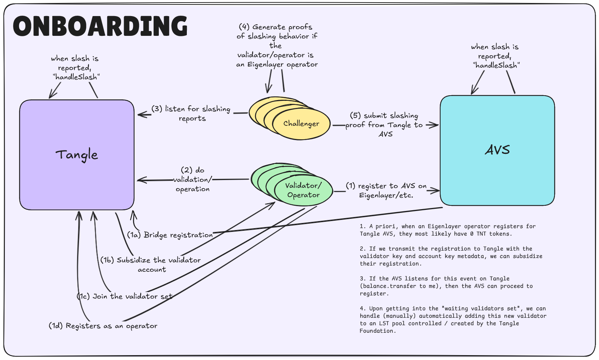
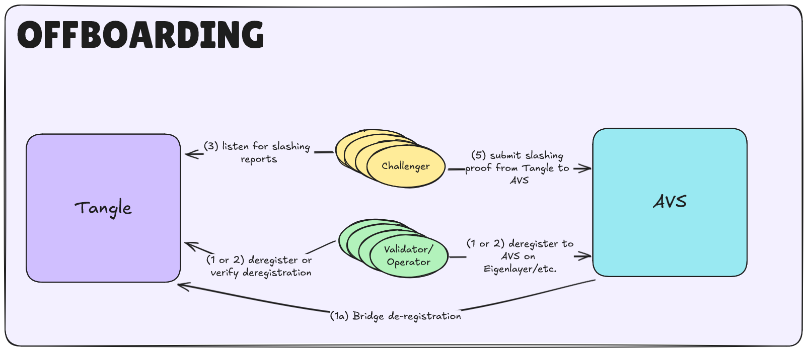

# Overview

Tangle AVS offers cross-chain restaking between Tangle and EigenLayer. Our system ensures that cross-chain actions,
specifically slashing, occur reliably, regardless of the network on which they originate or occur.

## Trust Model

The trust model for Tangle's cross-chain operations with EigenLayer is designed to be robust and transparent:

1. **Validator Responsibilities**: Operators running the Tangle AVS are subject to the slashing conditions of the
   Tangle main chain, including consensus failures and offline absences. Misbehavior on either network can result in consequences
   on both chains an operator is participating in.

2. **Cross-Chain Messaging**: We utilize a Hyperlane bridge to relay slashing events and rewards between both networks.

## How it Works

### Registration Flow

### De-registration Flow

### Key Points in the AVS Flows:

- **Registration**: Upon Registering to EigenLayer and the AVS, the registration event is communicated to Tangle's
  Network via a bridge. Following this cross-chain message, the node receives a reward in Tangle Tokens. Once receiving
  this rewards, the AVS will join the validator set and register as an Operator. The Validator now begins validating on Tangle.

- **De-registration**: A node can de-register from both networks, by sending a deregister event to the AVS. This event
  is forwarded to Tangle across the bridge to ensure the de-registration occurs on both networks.

- **Slashing**: When a validator misbehaves on EigenLayer, Tangle enforces the slashing event. Nodes listening for slashing events on Tangle forward that slashing to EigenLayer in exchange for a reward.
  Similarly, slashing events that originate on Tangle can be forwarded to non-Tangle networks to be handled accordingly.
  This centralized slashing mechanism ensures consistency and accountability.

## Where to Ask Questions

- Join our Discord to ask questions or join in on the discussions: [Tangle Discord](https://discord.com/invite/cv8EfJu3Tn)
- Telegram more your style? We're there too: [Tangle Telegram](https://t.me/tanglenet)
