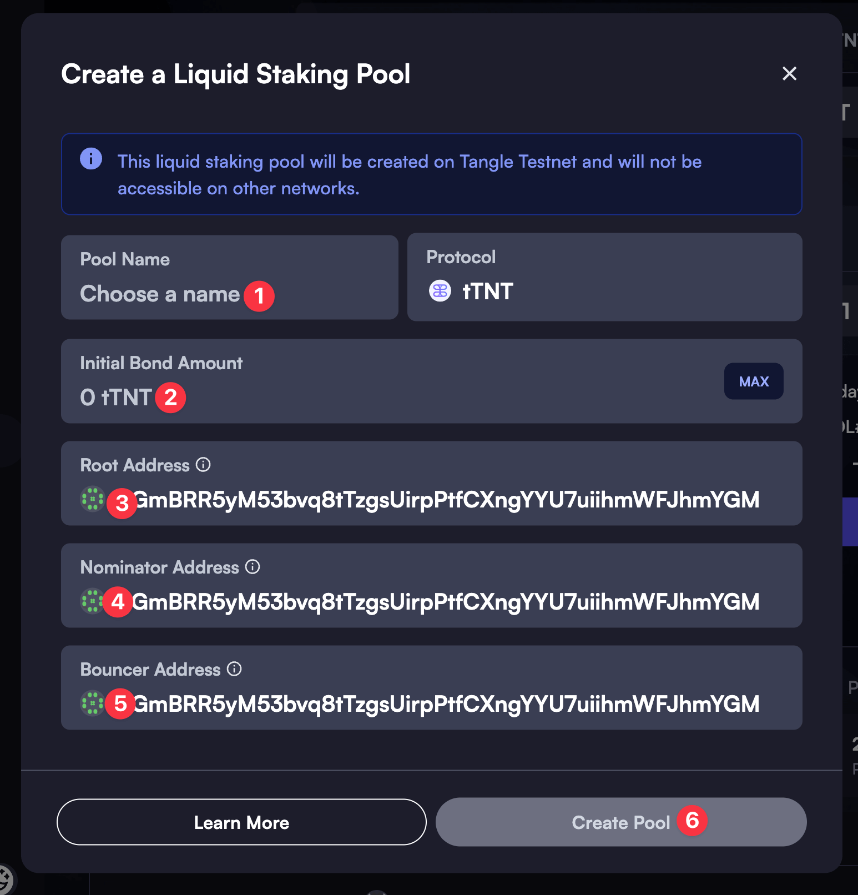
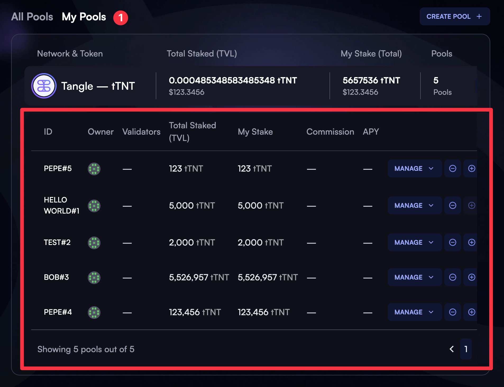

## How to Create a Liquid Staking Pool Using Tangle DApp

### Step 1: Access Tangle Dapp & Connect Wallet

- Open [Tangle Dapp's Liquid Staking page](https://app.tangle.tools/liquid-staking).
- Connect your wallet to the Dapp by clicking on the **Connect Wallet** button on the top right and selecting your preferred wallet provider.
- Connect to the desired Tangle network by selecting the appropriate network from the dropdown list. Note that liquid staking pools are only available on the networks in which they are created.

### Step 2: Configure & Create a Pool

- Once on the liquid staking page, scroll down until you see the **CREATE POOL** button. Click on it to bring up a form where you can configure your new pool.

- Choose a brief, descriptive name for your pool so that other users can easily identify it, enter an initial bond amount, and set the pool's roles (Root, Nominator, Bouncer).
- By default, all of the roles will be assigned to the active wallet's address. You can change these addresses to other accounts if needed.
- Some details such as the pool's commission and nominations can be set **after** the pool is created: You'll be able to easily manage it under the **My Pools** tab.
- Once you've entered and verified all the details, click on the **Create Pool** button to initiate the transaction.

- After you've created your pool, you can view & manage it under the **My Pools** tab. Here, you can set the commission rate, manage nominations, and view the pool's performance. In case that you don't see the pool you've just created right away, try refreshing the page.
- Note that the `MANAGE` button or some of its dropdown options will only be visible **if the active account has the corresponding role**. For example, only the account with the nominator role will be able to see the `Update Nominations` button on the dropdown. If you've set all roles to the same account, you will have all the management options available.

