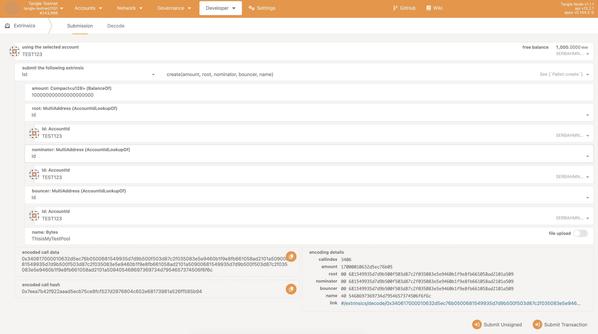
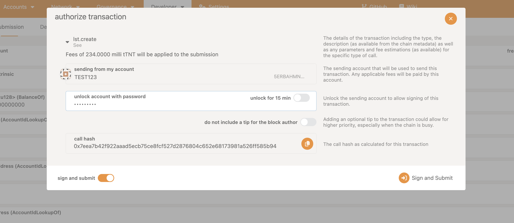
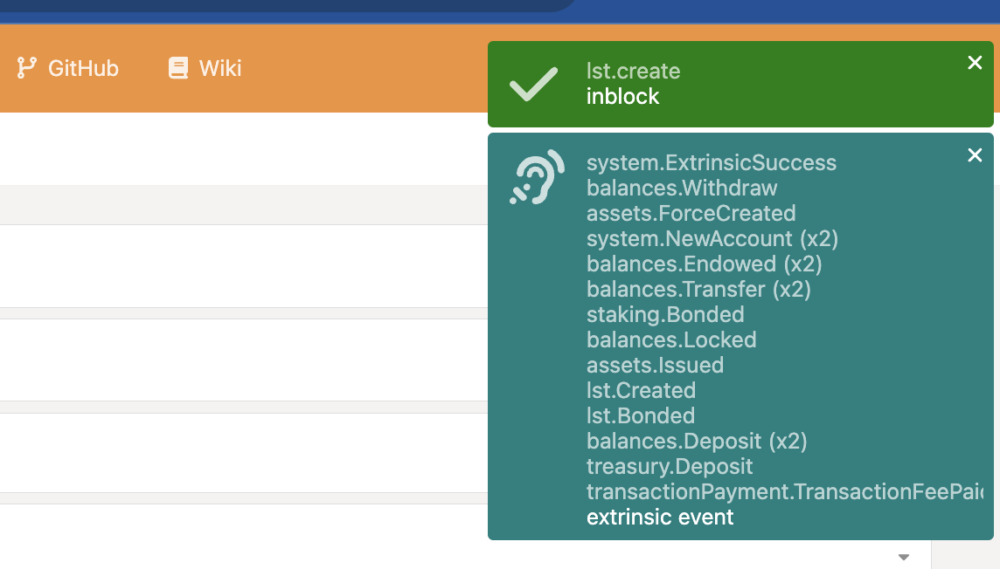
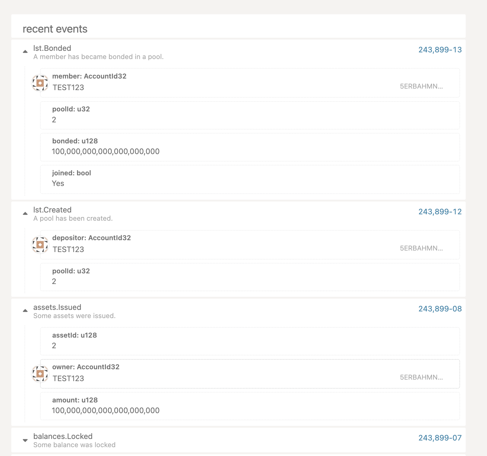
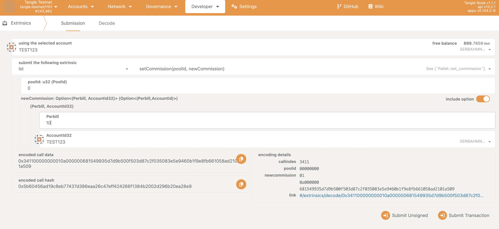

## How to Create a Liquid Staking Pool Using PolkadotJS

Creating a liquid staking pool on the Tangle Network using PolkadotJS is a straightforward process. Follow these steps:

### Step 1: Access the PolkadotJS Interface

- Open [PolkadotJS Apps](https://polkadot.js.org/apps/).
- Connect to the Tangle Network by selecting the appropriate network from the dropdown list.

Alternatively, you can access it via the tangle explorer:

- The Tangle Testnet is available at: https://polkadot.js.org/apps/?rpc=wss%3A%2F%2Ftestnet-rpc.tangle.tools#/explorer
- The tangle mainnet is available at: https://polkadot.js.org/apps/?rpc=wss%3A%2F%2Frpc.tangle.tools#/explorer

### Step 2: Create a Pool

- Navigate to the **Extrinsics** tab on PolkadotJS.

- Under the **Lst** section, select **Create**.
- Enter the required details such as:
  - **Initial deposit amount**: The amount of tokens you are contributing to the pool. This is in lowest unit, so should use 18 decimal places.
  - **Root account**: The account that will be responsible for managing the pool.
  - **Nominator account**: The account that will nominate validators for the pool.
  - **Bouncer account**: The account responsible for managing participant entries and exits.
  - **Pool Name**: Choose a unique and descriptive name for your pool.

You can use the same account for the root, nominator and bouncer or different accounts.

Sign and submit the transaction. Make sure the account you are using has enough balance to cover the transaction fee and pool deposit.

If successful, you should see the following screen:

Lets break down the events, navigate to the **Network** tab, you should see the following events:

- lst.Bonded : tells you that the pool has been created and the initial deposit has been made.
- lst.Created : tells you that the pool has been created and shows the pool id.
- assets.Issued : tells you that the pool has created a new asset (LST) and issued the staked tokens to the creator.

### Step 3: Configure Commission and Roles (Optional)

- Set the commission rate you wish to charge as the pool manager.

You can do this by navigating to the **Extrinsics** tab, under the **Lst** section, select **SetCommission**.

