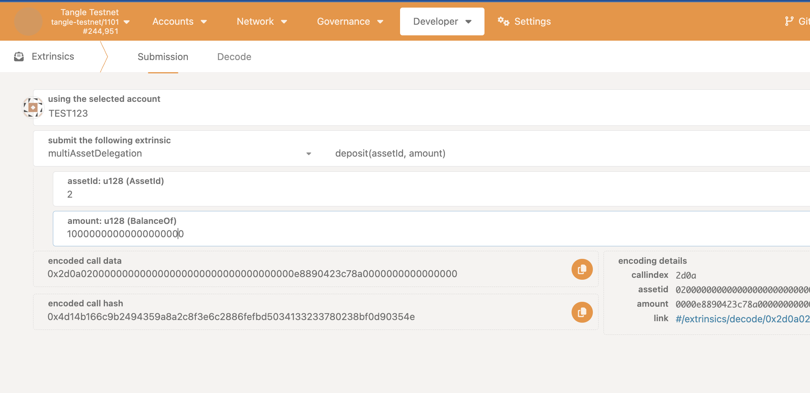
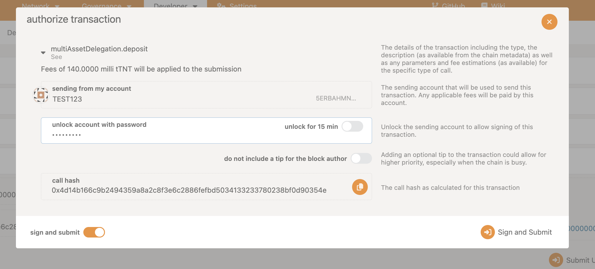
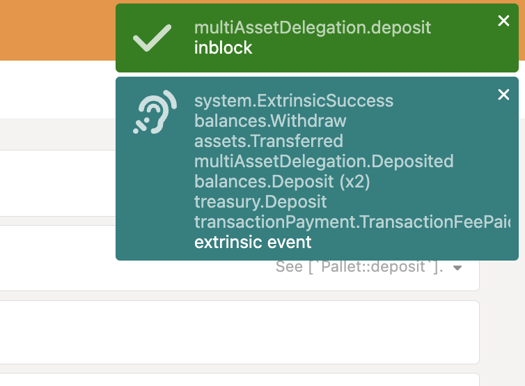

## Deposit

Deposit is the process of allocating assets to the multiasset delegation vault. This deposit is required to participate in restaking (delegate).

### Deposit Assets

To participate in restaking, a user can deposit LST assets to the multiasset delegation vault.

### Step 1: Access the PolkadotJS Interface

- Open [PolkadotJS Apps](https://polkadot.js.org/apps/).
- Connect to the Tangle Network by selecting the appropriate network from the dropdown list.

Alternatively, you can access it via the tangle explorer:

- The Tangle Testnet is available at: https://polkadot.js.org/apps/?rpc=wss%3A%2F%2Ftestnet-rpc.tangle.tools#/explorer
- The Tangle Mainnet is available at: https://polkadot.js.org/apps/?rpc=wss%3A%2F%2Frpc.tangle.tools#/explorer

### Step 2: Deposit Assets

- Navigate to the **Extrinsics** tab on PolkadotJS.

- Under the **MultiAssetDelegation** section, select **Deposit** and enter the amount of assets to deposit.

Sign and submit the transaction. Make sure the account you are using has enough balance to cover the transaction fee.

If successful, you should see the following screen:

