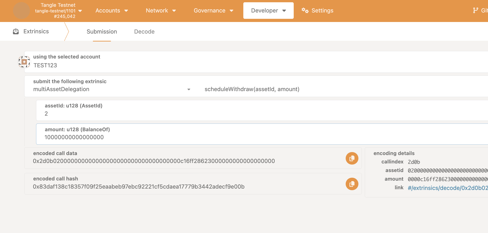
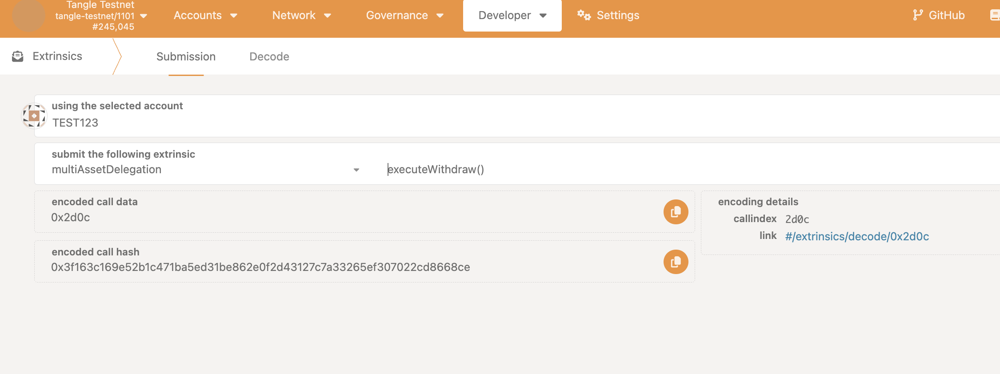

## Withdraw

Withdraw is the process of withdrawing assets from the multiasset delegation vault. You can only withdraw your "undelegated" assets. So make sure you have undelegated your assets before withdrawing.
The process of withdrawal is a two step process. First you need to schedule a withdrawal, which will be available after the unstake period. Then after the unstake period, you can actually withdraw the assets.

### Schedule Withdraw

The first step to complete a withdraw is to schedule a withdrawal. This is done by calling the `schedule_withdraw` function.

### Step 1: Access the PolkadotJS Interface

- Open [PolkadotJS Apps](https://polkadot.js.org/apps/).
- Connect to the Tangle Network by selecting the appropriate network from the dropdown list.

Alternatively, you can access it via the tangle explorer:

- The Tangle Testnet is available at: https://polkadot.js.org/apps/?rpc=wss%3A%2F%2Ftestnet-rpc.tangle.tools#/explorer
- The Tangle Mainnet is available at: https://polkadot.js.org/apps/?rpc=wss%3A%2F%2Frpc.tangle.tools#/explorer

### Step 2: Schedule Withdraw

- Navigate to the **Extrinsics** tab on PolkadotJS.

- Under the **MultiAssetDelegation** section, select **ScheduleWithdraw** and enter the amount of assets to withdraw.

Sign and submit the transaction. Make sure the account you are using has enough balance to cover the transaction fee.

### Execute Withdraw

The second step to complete a withdraw is to execute the withdrawal. This is done by calling the `execute_withdraw` function.

### Step 1: Access the PolkadotJS Interface

- Open [PolkadotJS Apps](https://polkadot.js.org/apps/).
- Connect to the Tangle Network by selecting the appropriate network from the dropdown list.

Alternatively, you can access it via the tangle explorer:

- The Tangle Testnet is available at: https://polkadot.js.org/apps/?rpc=wss%3A%2F%2Ftestnet-rpc.tangle.tools#/explorer
- The Tangle Mainnet is available at: https://polkadot.js.org/apps/?rpc=wss%3A%2F%2Frpc.tangle.tools#/explorer

### Step 2: Execute Withdraw

- Navigate to the **Extrinsics** tab on PolkadotJS.

- Under the **MultiAssetDelegation** section, select **ScheduleWithdraw** and enter the amount of assets to withdraw.

Sign and submit the transaction. Make sure the account you are using has enough balance to cover the transaction fee.
