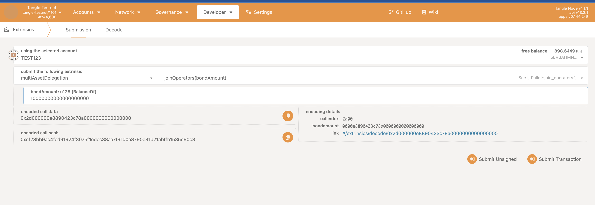
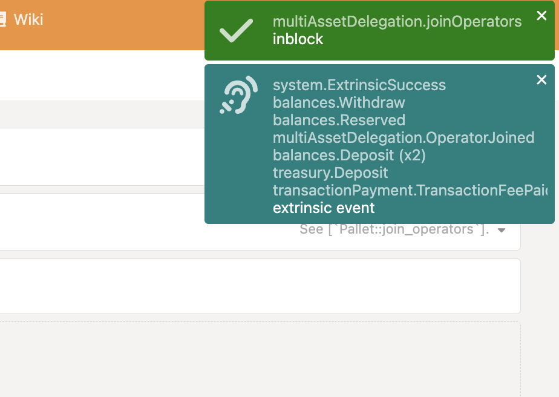
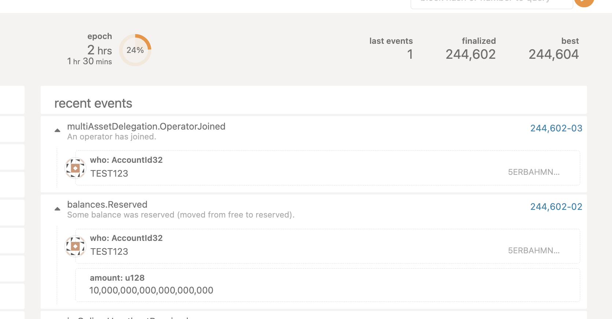

## Operators

Operators are noderunners that have tokens at stake and choose to restake them to enable participation in roles, which conduct the jobs produced by a blueprint instance. In esssence, Operators are service providers whose effectiveness and security is guarenteed by their restaked assets.

### Joining as an Operator

To participate in restaking, a user can join as an operator by providing a bond amount through the ``join_operators function. This registers the user as an operator and locks their bond, which is necessary for participating in the network and receiving rewards.

### Step 1: Access the PolkadotJS Interface

- Open [PolkadotJS Apps](https://polkadot.js.org/apps/).
- Connect to the Tangle Network by selecting the appropriate network from the dropdown list.

Alternatively, you can access it via the tangle explorer:

- The Tangle Testnet is available at: https://polkadot.js.org/apps/?rpc=wss%3A%2F%2Ftestnet-rpc.tangle.tools#/explorer
- The Tangle Mainnet is available at: https://polkadot.js.org/apps/?rpc=wss%3A%2F%2Frpc.tangle.tools#/explorer

### Step 2: Join as an Operator

- Navigate to the **Extrinsics** tab on PolkadotJS.

- Under the **MultiAssetDelegation** section, select **Join Operators** and enter the bond amount.

Sign and submit the transaction. Make sure the account you are using has enough balance to cover the transaction fee and bond.

If successful, you should see the following screen:

Lets break down the events, navigate to the **Network** tab, you should see the following events:

- multi_asset_delegation.OperatorJoined : tells you that the operator has joined successfully.
