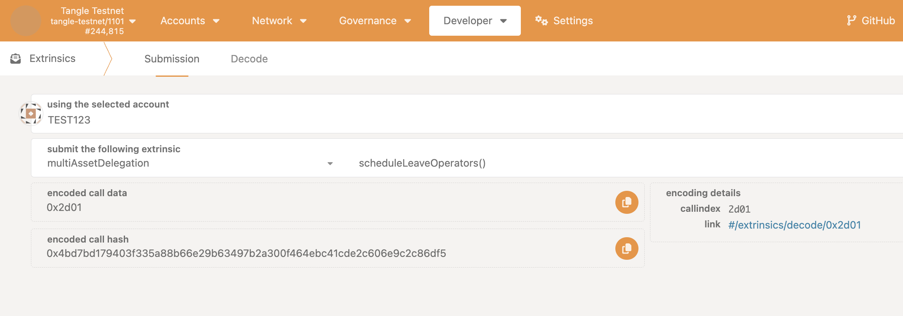
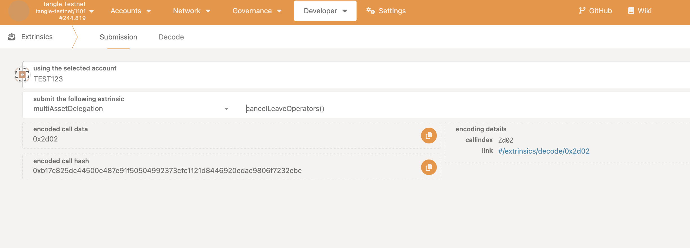
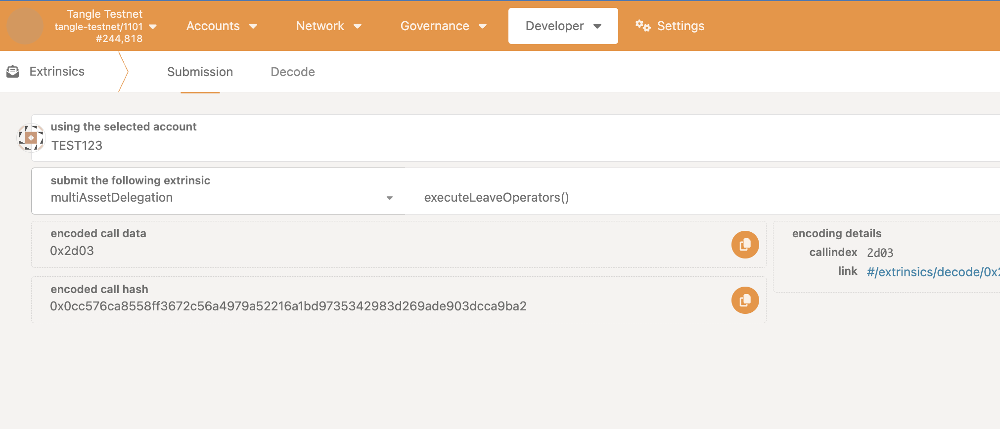

## Leave as an Operator

Operators can leave the operator role by unstaking their tokens. The leave process is similar to the unstake process, which means its a two step process, first you schedule a leave operation 
and then you execute the leave operation after the leave delay period has passed. You can cancel the leave operation before it is executed.

## Schedule Operator Leave

### Step 1: Access the PolkadotJS Interface

- Open [PolkadotJS Apps](https://polkadot.js.org/apps/).
- Connect to the Tangle Network by selecting the appropriate network from the dropdown list.

Alternatively, you can access it via the tangle explorer:

- The tangle testnet is available at: https://polkadot.js.org/apps/?rpc=wss%3A%2F%2Ftestnet-rpc.tangle.tools#/explorer
- The tangle mainnet is available at: https://polkadot.js.org/apps/?rpc=wss%3A%2F%2Frpc.tangle.tools#/explorer

### Step 2: Schedule Operator Leave

Ensure you have joined as an operator first, see [Join as an Operator](./join.mdx).

- Navigate to the **Extrinsics** tab on PolkadotJS.

- Under the **MultiAssetDelegation** section, select **Schedule Operator Leave**

Sign and submit the transaction. Make sure the account you are using has enough balance to cover the transaction fee and bond.

If successful, your leave will be scheduled.

## Cancel Operator Leave

### Step 1: Access the PolkadotJS Interface

- Open [PolkadotJS Apps](https://polkadot.js.org/apps/).
- Connect to the Tangle Network by selecting the appropriate network from the dropdown list.

Alternatively, you can access it via the tangle explorer:

- The tangle testnet is available at: https://polkadot.js.org/apps/?rpc=wss%3A%2F%2Ftestnet-rpc.tangle.tools#/explorer
- The tangle mainnet is available at: https://polkadot.js.org/apps/?rpc=wss%3A%2F%2Frpc.tangle.tools#/explorer

### Step 2: Cancel Operator Unstake

Ensure you have joined as an operator first, see [Join as an Operator](./join.mdx) and have scheduled an leave.

- Navigate to the **Extrinsics** tab on PolkadotJS.

- Under the **MultiAssetDelegation** section, select **Cancel Operator Leave**

Sign and submit the transaction. Make sure the account you are using has enough balance to cover the transaction fee and bond.

If successful, your unstake will be canceled.

## Execute Operator Leave

### Step 1: Access the PolkadotJS Interface

- Open [PolkadotJS Apps](https://polkadot.js.org/apps/).
- Connect to the Tangle Network by selecting the appropriate network from the dropdown list.

Alternatively, you can access it via the tangle explorer:

- The tangle testnet is available at: https://polkadot.js.org/apps/?rpc=wss%3A%2F%2Ftestnet-rpc.tangle.tools#/explorer
- The tangle mainnet is available at: https://polkadot.js.org/apps/?rpc=wss%3A%2F%2Frpc.tangle.tools#/explorer

### Step 2: Execute Operator Leave

Ensure you have joined as an operator first, see [Join as an Operator](./join.mdx) and have scheduled a leave, also ensure the leave delay period has passed.

- Navigate to the **Extrinsics** tab on PolkadotJS.

- Under the **MultiAssetDelegation** section, select **Execute Operator Leave**

Sign and submit the transaction. Make sure the account you are using has enough balance to cover the transaction fee and bond.

If successful, you will no longer be an operator.
