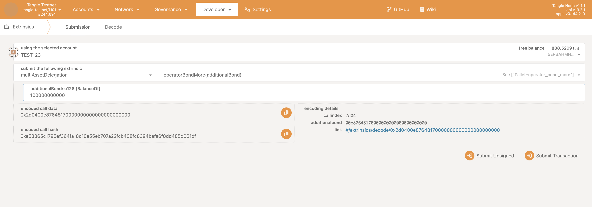
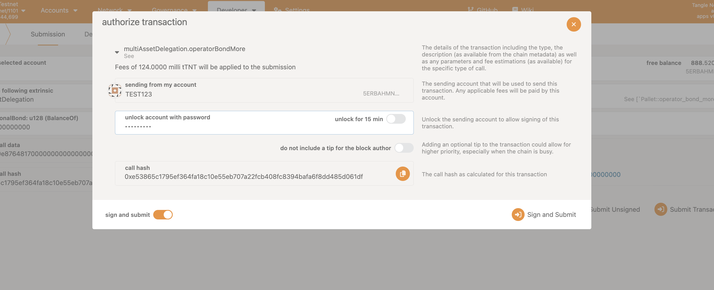
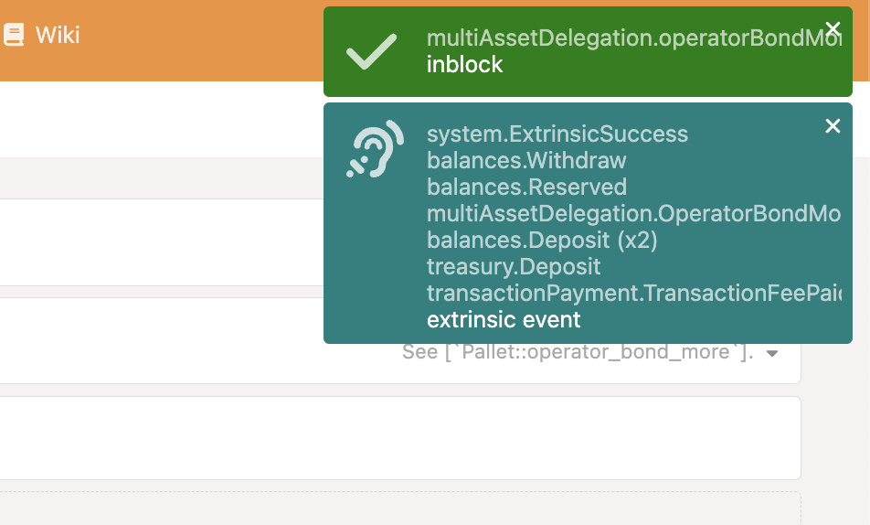
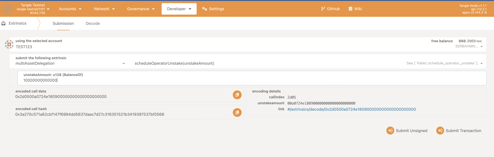
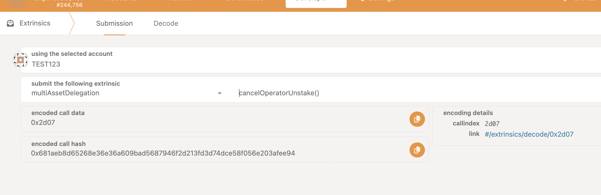
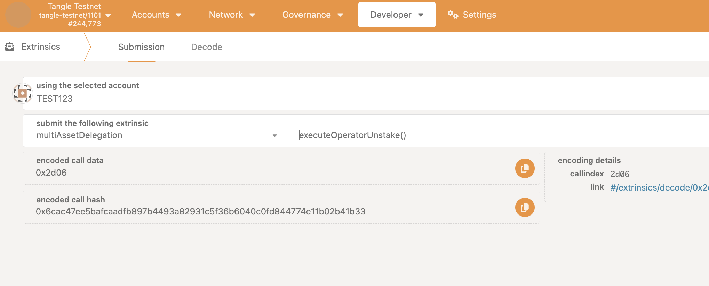

## Staking as an Operator

Operators can increase their stake to participate to increase their chances of being selected for roles or to signal their commitment to the network.

## Bond More

### Step 1: Access the PolkadotJS Interface

- Open [PolkadotJS Apps](https://polkadot.js.org/apps/).
- Connect to the Tangle Network by selecting the appropriate network from the dropdown list.

Alternatively, you can access it via the tangle explorer:

- The Tangle Testnet is available at: https://polkadot.js.org/apps/?rpc=wss%3A%2F%2Ftestnet-rpc.tangle.tools#/explorer
- The Tangle Mainnet is available at: https://polkadot.js.org/apps/?rpc=wss%3A%2F%2Frpc.tangle.tools#/explorer

### Step 2: Bond More as an Operator

Ensure you have joined as an operator first, see [Join as an Operator](./join.mdx).

- Navigate to the **Extrinsics** tab on PolkadotJS.

- Under the **MultiAssetDelegation** section, select **Operator Bond More** and enter the bond amount.

Sign and submit the transaction. Make sure the account you are using has enough balance to cover the transaction fee and bond.

If successful, you should see the following screen:

## Schedule Operator Unstake

### Step 1: Access the PolkadotJS Interface

- Open [PolkadotJS Apps](https://polkadot.js.org/apps/).
- Connect to the Tangle Network by selecting the appropriate network from the dropdown list.

Alternatively, you can access it via the tangle explorer:

- The Tangle Testnet is available at: https://polkadot.js.org/apps/?rpc=wss%3A%2F%2Ftestnet-rpc.tangle.tools#/explorer
- The tangle mainnet is available at: https://polkadot.js.org/apps/?rpc=wss%3A%2F%2Frpc.tangle.tools#/explorer

### Step 2: Schedule Operator Unstake

Ensure you have joined as an operator first, see [Join as an Operator](./join.mdx).

- Navigate to the **Extrinsics** tab on PolkadotJS.

- Under the **MultiAssetDelegation** section, select **Schedule Operator Unstake** and enter the amount to unstake.

Sign and submit the transaction. Make sure the account you are using has enough balance to cover the transaction fee and bond.

If successful, your tokens will be unlocked after the unstake delay period.

## Cancel Operator Unstake

### Step 1: Access the PolkadotJS Interface

- Open [PolkadotJS Apps](https://polkadot.js.org/apps/).
- Connect to the Tangle Network by selecting the appropriate network from the dropdown list.

Alternatively, you can access it via the tangle explorer:

- The Tangle Testnet is available at: https://polkadot.js.org/apps/?rpc=wss%3A%2F%2Ftestnet-rpc.tangle.tools#/explorer
- The Tangle Mainnet is available at: https://polkadot.js.org/apps/?rpc=wss%3A%2F%2Frpc.tangle.tools#/explorer

### Step 2: Cancel Operator Unstake

Ensure you have joined as an operator first, see [Join as an Operator](./join.mdx) and have scheduled an unstake.

- Navigate to the **Extrinsics** tab on PolkadotJS.

- Under the **MultiAssetDelegation** section, select **Cancel Operator Unstake** and enter the amount to cancel.

Sign and submit the transaction. Make sure the account you are using has enough balance to cover the transaction fee and bond.

If successful, your unstake will be canceled.

## Execute Operator Unstake

### Step 1: Access the PolkadotJS Interface

- Open [PolkadotJS Apps](https://polkadot.js.org/apps/).
- Connect to the Tangle Network by selecting the appropriate network from the dropdown list.

Alternatively, you can access it via the tangle explorer:

- The Tangle Testnet is available at: https://polkadot.js.org/apps/?rpc=wss%3A%2F%2Ftestnet-rpc.tangle.tools#/explorer
- The Tangle Mainnet is available at: https://polkadot.js.org/apps/?rpc=wss%3A%2F%2Frpc.tangle.tools#/explorer

### Step 2: Execute Operator Unstake

Ensure you have joined as an operator first, see [Join as an Operator](./join.mdx) and have scheduled an unstake, also ensure the unstake delay period has passed.

- Navigate to the **Extrinsics** tab on PolkadotJS.

- Under the **MultiAssetDelegation** section, select **Execute Operator Unstake**

Sign and submit the transaction. Make sure the account you are using has enough balance to cover the transaction fee and bond.

If successful, all unstaked tokens will be unlocked and returned to the operator.
