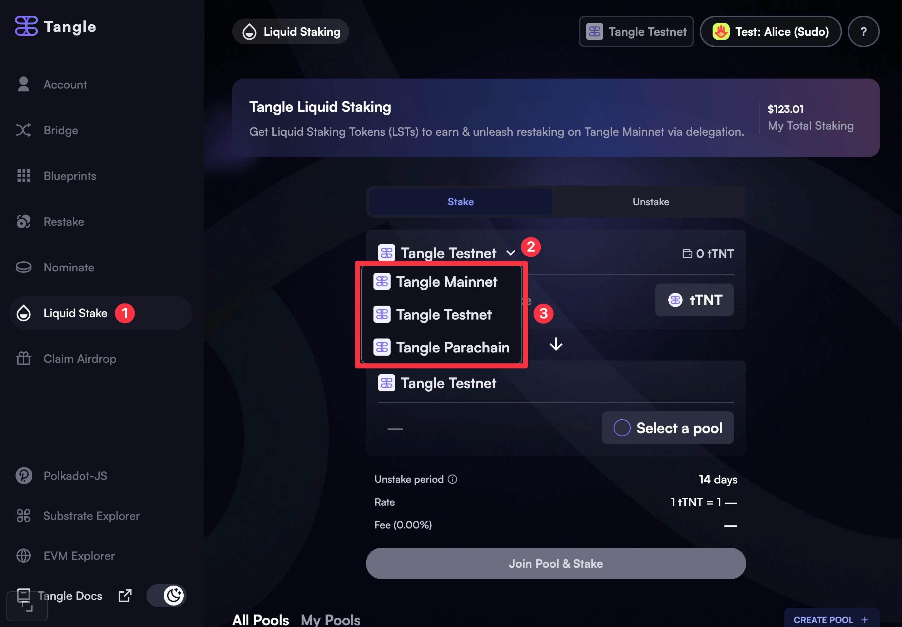
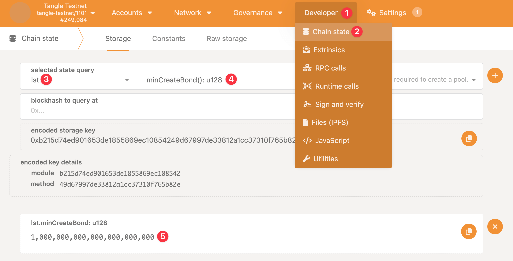
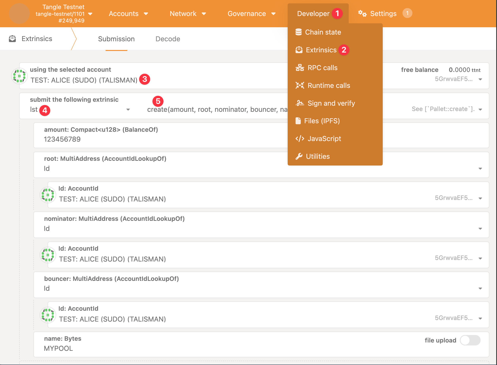

## Introduction to Liquid Staking Pools

A **liquid staking pool** on the Tangle network is a collective staking mechanism that allows users to pool their assets together to participate in staking. These pools enable participants to earn staking rewards while maintaining liquidity through tokenized derivatives. The primary purpose of a staking pool is to lower the barriers to entry for staking, allowing users with smaller token holdings to stake and earn rewards without having to operate a validator themselves.

## How a Liquid Staking Pool Works

In a liquid staking pool, users deposit their tokens into the pool. The pooled assets are then staked collectively on behalf of the participants. The rewards earned from staking are shared among pool members based on their contribution. A pool is managed by specific roles such as the root, nominator, and bouncer, ensuring the pool's smooth operation, security, and optimal reward distribution.

Liquid staking pools offer participants flexibility, allowing them to unstake their assets or use liquid derivatives without waiting for the traditional lock-up periods.

## Roles in a Liquid Staking Pool

There are several key roles involved in creating and maintaining a liquid staking pool:

### 1. **Root**

- **Role Description:** The root is the administrator of the pool with full control over its operations. They are responsible for setting and updating pool roles and managing critical operations like commission setup and governance decisions.
- **Benefits:** As the root, you have the ability to control the overall direction of the pool, set commission rates, and earn a portion of the staking rewards through commissions.
- **Risks:** The root must ensure that the pool operates fairly and transparently to maintain the trust of the participants. Mismanagement or excessive fees could drive users away.

### 2. **Nominator**

- **Role Description:** The nominator is responsible for selecting validators on behalf of the pool. Their role is critical in optimizing rewards for the pool members by choosing high-performing and secure validators.
- **Benefits:** The nominator can enhance the pool’s performance by choosing the best validators, maximizing rewards for participants.
- **Risks:** Poor validator selection could result in missed rewards or penalties, impacting the overall pool performance and the trust of participants.

### 3. **Bouncer**

- **Role Description:** The bouncer is responsible for managing the entry and exit of participants into the pool. They can block or allow participants, as well as manage pool access settings.
- **Benefits:** This role ensures the integrity of the pool by maintaining strict control over its participants.
- **Risks:** If the bouncer mismanages pool access or fails to protect against malicious actors, it can result in pool exploitation or security vulnerabilities.

### 4. **Depositor**

- **Role Description:** The depositor is the individual or entity that creates the pool by making an initial deposit. This role is critical because the depositor effectively initiates the pool’s staking process.
- **Benefits:** As the creator of the pool, the depositor can dictate initial terms and pool configurations. They also have the opportunity to collect significant rewards from the pool’s success.
- **Risks:** The depositor’s funds are locked as long as the pool remains operational, limiting liquidity. If the pool fails to attract enough participants or operate effectively, the depositor may face opportunity costs.

## Benefits of Creating a Liquid Staking Pool

### 1. **Economies of Scale**

- **Benefit:** By pooling assets together, the staking pool can achieve economies of scale. This means more efficient use of resources, lower transaction costs, and potentially higher rewards for participants. Larger pools can negotiate better validator terms and achieve optimized staking performance.
- **Impact:** As the pool grows in size, the overall staking performance improves, benefiting both the creator and participants with higher collective rewards.

### 2. **Earning Commission**

- **Benefit:** As the root or operator of the pool, you have the ability to set commission rates on staking rewards. This commission is taken from the pool’s rewards and serves as compensation for managing and maintaining the pool.
- **Impact:** The ability to earn a commission makes creating and managing a pool financially rewarding. Commission earnings grow as the pool attracts more participants.

### 3. **Building a Community**

- **Benefit:** A well-managed staking pool can attract a large number of participants. As the pool creator, you can build a strong community around your pool, fostering trust and loyalty.
- **Impact:** A loyal community of participants ensures a steady inflow of assets into the pool, making it sustainable in the long term. This can also enhance the pool’s reputation and attract more participants.

### 4. **Increased Security and Decentralization**

- **Benefit:** By creating a liquid staking pool, you contribute to the overall security and decentralization of the Tangle network. Larger pools with more participants help secure the network by distributing stake across multiple validators.
- **Impact:** A decentralized network is more secure and resilient, benefiting the entire ecosystem. As a pool creator, you play a role in strengthening the Tangle network’s security and robustness.

## Risks of Creating and Managing a Pool

### 1. **Validator Performance Risk**

- **Risk:** If the pool’s nominator selects poor-performing validators, the pool could lose rewards or face slashing penalties. This could lead to a loss of trust among participants and damage the pool’s reputation.
- **Mitigation:** To minimize this risk, pool operators should conduct thorough research and choose validators with a proven track record of reliability and performance.

### 2. **Security Risks**

- **Risk:** Pools can be targeted by malicious actors who seek to exploit vulnerabilities in pool management or validator selection.
- **Mitigation:** Pool operators should implement strong security practices, such as regularly auditing pool operations, ensuring proper governance mechanisms, and closely monitoring participant behavior.

## How to Create a Liquid Staking Pool Using Tangle Dapp

Creating a liquid staking pool on the Tangle network using Tangle Dapp is a straightforward process. Follow these steps:

### Step 1: Access Tangle Dapp & Connect Wallet

- Open [Tangle Dapp's Liquid Staking page](https://app.tangle.tools/liquid-staking).
- Connect to the desired Tangle network by selecting the appropriate network from the dropdown list. Note that liquid staking pools are only available on the networks in which they are created.

## How to Create a Liquid Staking Pool Using PolkadotJS

In case that you'd like to use the PolkadotJS UI, follow these steps to create a liquid staking pool:

### Step 1: Access the PolkadotJS Interface

- Open [PolkadotJS Apps](https://polkadot.js.org/apps/).
- Connect to the desired Tangle network by selecting the appropriate network from the left dropdown list. Note that liquid staking pools are only available on the networks in which they are created.
- In case that the network that you're looking for is not listed on the dropdown list, input its RPC endpoint under the `DEVELOPMENT` → `custom endpoint` input.

### Step 2: Check Pool Creation Requirements

- In order to prevent spam, pool creation may require a minimum bond amount to be deposited. Ensure that you have enough funds in your account to cover this requirement.
- These funds will not be forfeited; they will be bonded to the pool and will be returned to you when the pool is dissolved.

### Step 3: Create a Pool

- Navigate to the **Extrinsics** tab on PolkadotJS.
- Under the **Lst** section, select **Create Pool**.
- Enter the required details such as:
  - **Initial deposit amount**: The amount of tokens you are contributing to the pool. This serves as the initial deposit.
  - **Root account address**: The account that will be responsible for managing the pool.
  - **Nominator account address**: The account that will nominate validators for the pool.
  - **Bouncer account address**: The account responsible for managing participant entries and exits.
  - **Pool Name**: Choose a unique and descriptive name for your pool.

### Step 4: Configure Commission and Roles

- Set the commission rate you wish to charge as the pool manager.
- Assign roles (Root, Nominator, Bouncer) as appropriate for your pool’s structure.

### Step 5: Confirm and Create

- Review the details carefully to ensure all information is correct.
- Click **Submit Transaction** to create your liquid staking pool.
