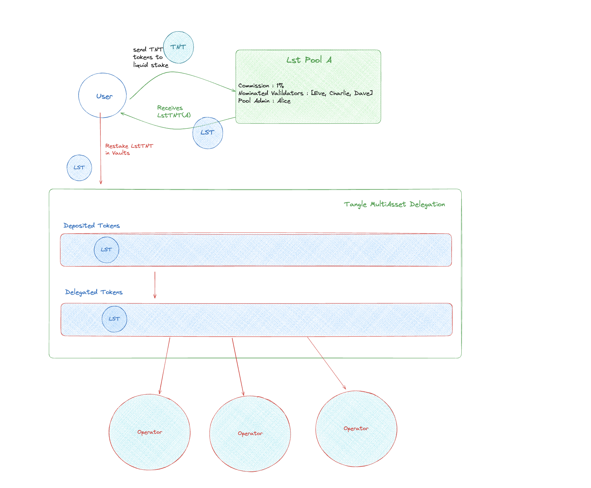

# Introduction to Restaking

Restaking is an innovative concept in blockchain technology that allows validators to reuse their staked tokens to provide additional services and earn rewards without unstaking from the original network. This enhances the efficiency and utility of staked assets.

In a typical proof-of-stake blockchain, validators lock up tokens to participate in block production and earn staking rewards. Those staked tokens cannot be used for any other purpose. Restaking changes this by enabling those same staked tokens to be "restaked" to provide other services and earn additional rewards on top of the base staking rewards.

This is achieved by the validator opting-in to restake a portion of their staked tokens into a restaking protocol or application, becoming an "operator". The staked tokens still remain staked on the original chain and earn their base rewards. But they are now also being used to provide security, computation, or other services to the restaking protocol, allowing the now-operator to earn additional restaking rewards.

## Benefits of restaking include:

- Increased efficiency of staked capital
- Additional revenue streams for stakers
- Boosted security for restaking protocols by leveraging security of the underlying chain
- Innovation in new blockchain services by harnessing decentralized resources

## How Tangle Network Uses Restaking

Tangle Network has implemented a unique restaking system to allow its validator set to provide Actively Validated Services (AVS) to power advanced decentralized applications. Users can restake their TNT tokens to run service instances based on blueprints created by developers.

Tangle noderunners can opt-in to restake a portion of their staked TNT tokens to provide AVS instances such as oracles, privacy-preserving computation, and more. In return, they earn service fees and additional inflation rewards on top of their base validation rewards.

### Here's how it works:

1. Developers create blueprints that define the specifications and requirements for AVS instances.
2. Operators create a restaking profile by allocating their restaked TNT to specific blueprints they want to support.
3. Users can request AVS instances from Tangle's restaked Operators for a fee. Requested instances are assigned to restaked operators based on the blueprint's criteria.
4. Operators must execute the AVS instances they are assigned. Failure to do so may result in penalties or reduced rewards.
5. Participating operators earn the service fees and proportional inflation rewards based on their restaked amounts and instances executed.

This restaking model allows Tangle to offer unique AVS instances powered by its decentralized validator set. Developers can leverage these services to easily deploy advanced decentralized applications like trustless cross-chain bridges, privacy solutions, identity systems, and more.

By restaking, Tangle noderunners gain additional revenue, the network gains efficiency from its staked supply, and the ecosystem gains access to powerful new primitives to fuel innovation. Restaking helps align incentives and harness the security of the underlying proof-of-stake blockchain for exciting new use cases.
